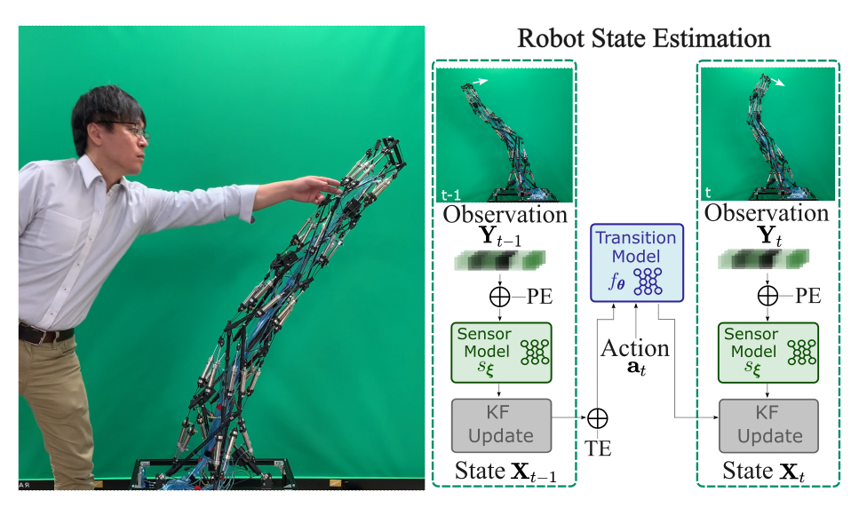

# soft_robot_DEnKF
This repository is the official implementation of the paper "[Learning Soft Robot Dynamics using Differentiable Kalman Filters and Spatio-Temporal Embeddings](https://arxiv.org/abs/2308.09868)", which has been accepted to 2023 IEEE/RSJ International Conference on Intelligent Robots and Systems (IROS 2023)

<p align="center">

</p>

## Getting Started

#### 1. docker workflow

Clone the repo `git clone https://github.com/ir-lab/soft_robot_DEnKF.git` and then set the environment variables.
Edit the `conf.sh` file to set the environment variables used to start the docker 
containers. 

```
IMAGE_TAG=  # unique tag to be used for the docker image.
CONTAINER_NAME=UR5  # name of the docker container.
DATASET_PATH=/home/xiao/datasets/  # Dataset path on the host machine.
CUDA_VISIBLE_DEVICES=0  # comma-separated list of GPU's to set visible.
```
Build the docker image by running `./build.sh`.


#### 2. Training or testing - PyTorch
Create or a modify a yaml file found in `./pyTorch/config/tensegrity_xx.yaml` 
with the appropriate parameters. Set the mode parameter to perform the 
training or testing routine. 

```
mode:
    mode: 'train'  # 'train' | 'test'
```

Run the training and test script using the bash file `./run_filter.sh $CONFIG_FILE` 
where `$CONFIG_FILE` is the path to the config file. e.g. 
`./run_filter.sh ./config/tensegrity_xx.yaml`. View the logs with `docker logs -f $CONTAINER_NAME`

#### 3. Tensorboard

Use the docker logs to copy the tensorboard link to a browser

```docker logs -f $CONTAINER_NAME-tensorboard```
 
#### 4. Without Docker

If you don't want to use the docker container for training, you may directly use the `train.py` script and pass in the config file. Make sure to have corresponding libraries and dependencies installed on your local machine. Plase refer to `requirement.txt` and `Dockerfile` for those required packages.
Go to `./soft_robot` and then
Run `python train.py --config ./config/tensegrity_xx.yaml`


## Models
### differentiable Ensemble Kalman Filters
This project introduces
a novel differentiable filter called differentiable Ensemble
Kalman Filters (DEnKF), for modeling soft robots. It offers
an end-to-end learning approach to estimate the state of the
system, which is highly nonlinear and difficult to model
analytically. The main contributions are:
- The introduction of a positional embedding process that
enables the spatial generalization of DEnKF by encoding
observations with respect to their positions. As a result,
learned models can account for changes to the location
of sensors on the robot body.
- The use of a temporal embedding process that allows
DEnKF to perform inference at variable rates and account
for a multitude of time-delays due to sensing,
hardware or communication.
- The modular structure of the framework separates the
state dynamics from the end-to-end learning process,
ensuring that the state remains dynamic even in the
absence of observations.
- The paper also demonstrates a downstream application
task of the of the framework for estimating human
contact and physical interactions with the robot.


## Datasets
#### Tensegrity_dataset
The Dataset is available upon request. (Dr. Ikemoto: ikemoto@brain.kyutech.ac.jp)


## Results

### Real-time Tracking
<p align="center">

</p>
The real-time estimation of the state on the tensegrity robot arm is demonstrated in this study. Specifically, the `left` figure presents a motion sequence of the robot without applying external forces, while the `right` figure showcases the real-time tracking outcomes (along with the corresponding uncertainty) of the positions of the hand tip.

### Comparison
Comparison with other baselines on state estimation
task measured in RMSE and MAE of the EE position
with fixed IMU locations Z. Results for dEKF, dPF, and
dPF-M-lrn are reproduced for detailed comparisons.

| Method    | RMSE | MAE (mm) | Wall clock time (s) |
| :------:| :------: | :------: | :------: |
| dEKF  | 61.753±1.630 | 41.960±1.147 | 0.047 |
| DPF | 51.184±7.204 | 34.317±4.205 | 0.060 |
| dPF-M-lrn | 49.799±8.264 | 33.903±6.964 | 0.059 |
| DEnKF | 31.519±9.974 | 25.777±7.827 | 0.062 |

## Citation
* Please cite the paper if you used any materials from this repo, Thanks.
```
@article{liu2023learning,
  title={Learning Soft Robot Dynamics using Differentiable Kalman Filters and Spatio-Temporal Embeddings},
  author={Liu, Xiao and Ikemoto, Shuhei and Yoshimitsu, Yuhei and Amor, Heni Ben},
  journal={arXiv preprint arXiv:2308.09868},
  year={2023}
}
```

